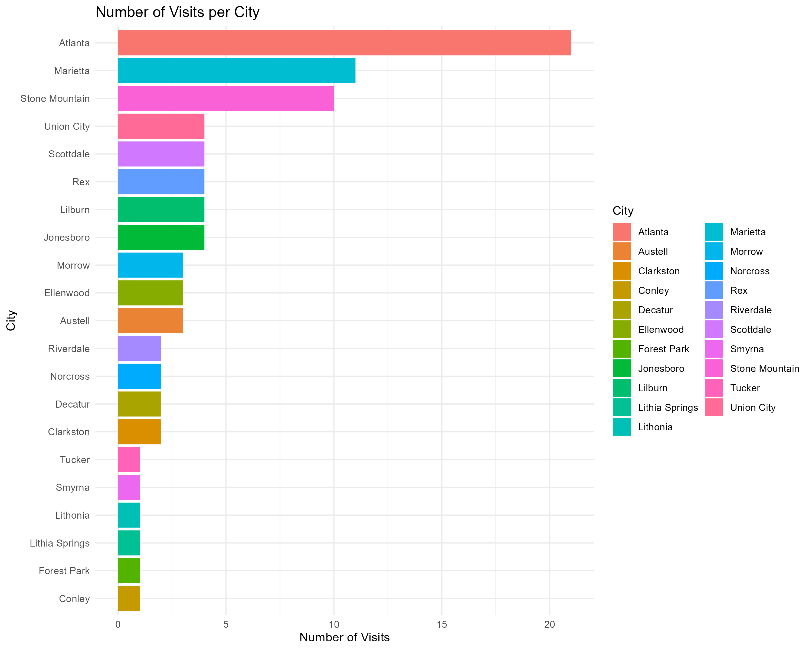

# Patient-Billing
Exploring healthcare data provides insights into patterns of visits to medical facilities based on various factors such as city, reason for visit, and time of year. By analyzing this data, we can identify trends that may help improve healthcare services and patient outcomes

### Reasons for Visits by City

 The distribution of visits across different cities reveals the demand for healthcare services in each location. Understanding this distribution can help in resource allocation and planning. 

#### Visualization

 The chart below visualizes the number of visits per city, highlighting how patient visits are distributed across different cities in the dataset. 

